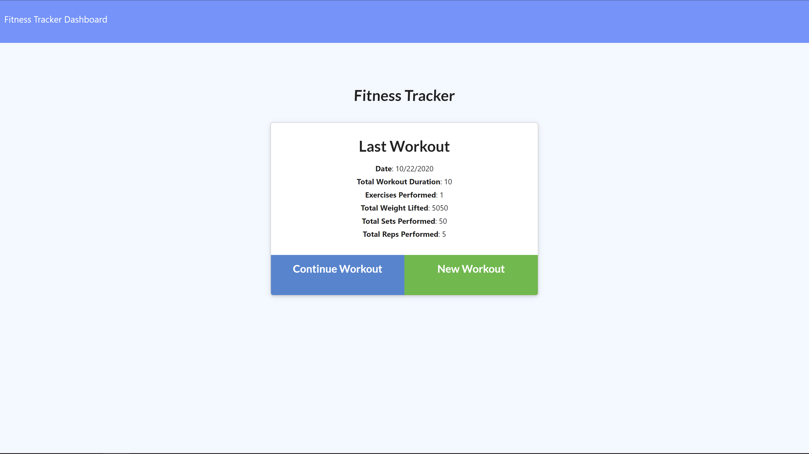

# FITNESS TRACKER

* [GitHub](https://github.com/modern-sapien/mongodb_workout_tracker)
* [Heroku Deployment](https://mongofitness-tracker.herokuapp.com/?id=5f91feb3ce73fb00177872cb)

## Technologies
Express, Heroku, Mongo DB, MongoDB Atlas, Mongoose

## Project Goals

This project's goals were for me to build the models and schema for the backend of a fitness tracker app and connect them through API routes and finishing with a deployment of a hosted database on Mongo Db & Heroku for a live application.

## Process
NOSQL databases are powerful and seemingly limitless in their scope of how you are able to related models to one another. The same process I completed in this project would have been more laborious using MySQL and Sequelize just but the nature of how you have to write out and relate the code to other "moving pieces" like API routes.

By building a model for workouts that are applicable to both cardio & resistance, but not requiring any particular inputs it was easy and efficient to create a fitness tracker backend. After pairing this model with a basic server setup running mongoose & an efficient controller, I found the most difficult part of this project was a data entry error in how I connected my deployed database to Heroku.

## Considerations

The binding together of routes between front end and back end in a real world setting requires communication and agreement on naming conventions and standards. In the case of receiving a half completed project it can make deciphering where to start or how things will come together interesting. In this case it was relatively smooth, but I can imagine in other cases where a project was left unfinished by someone else it may almost be preferable to start from scratch if there aren't comments in the code helping others find their bearings.